**Project Requirement: Building an ETL Pipeline for Daily Flight Data using AWS Glue, Redshift, and Step Functions**
Objective:
To design and implement an ETL (Extract, Transform, Load) pipeline that processes daily flight data, enriching it with dimensional data, and loads it into Amazon Redshift for analysis. The pipeline will be triggered by new data arrivals in S3, managed through AWS Step Functions, and monitored via SNS notifications.

**Tables**
Dimension table - Contains preloaded airport code -
Fact table - some measurable attributes will be present, where we will
be upsert the data

**Key Points:**

Crawler Completion Check:

Issue: If the Glue job is triggered before the crawler completes, it may load outdated or empty data.
Solution: Implement a waiting mechanism in the AWS Step Function to ensure that the crawler has completed its execution before triggering the Glue job. This ensures that the Glue Data Catalog is up-to-date and reflects the latest data in S3.
Job Bookmarking for Incremental Load:

Automatic Incremental Load: Use job bookmarking in Glue to manage incremental loads based on Hive-like partitioning in S3. This allows the Glue job to process only new or updated data, optimizing performance and resource usage.
Denormalized Fact Table Design:

Design Consideration: The fact table is denormalized to include all relevant details such as airport name, city, and state. This design choice eliminates the need for repeated joins with the dimensional table, improving query performance and simplifying data analysis.

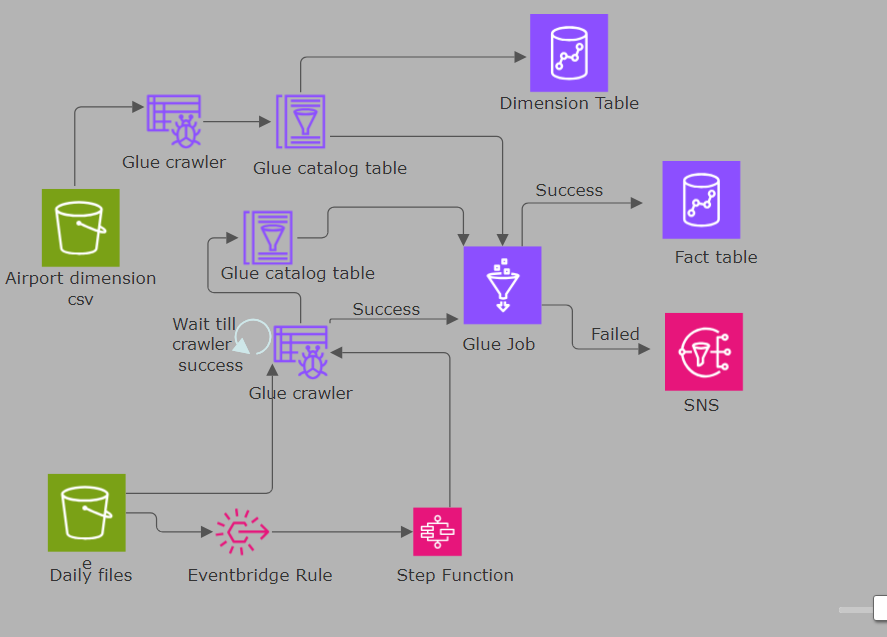{width="6.5in" height="4.666666666666667in"}

The dimension table, this is quite static - slowly changing dimension,
unlikely to change very frequently.

**Step 1. Creating S3 buckets and folder structures.**

Dimension table bucket and daily flight bucket have corresponding files.

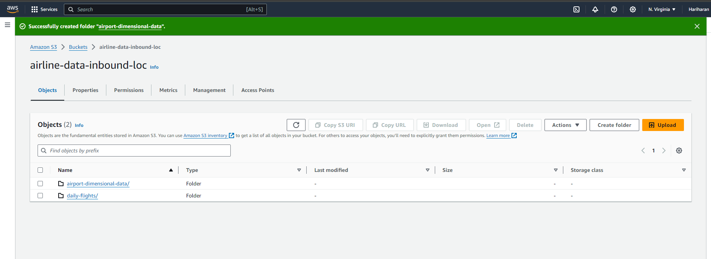{width="6.5in" height="2.375in"}

Dimensional data pre-loaded loaded in s3

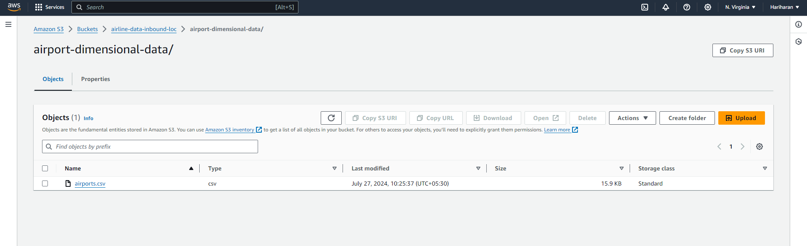{width="6.5in" height="1.9861111111111112in"}

Under the daily flights folder, flight data records are loaded on a
daily basis under a hive like partition and this file has 1 million
records, we can break it down and make multiple parts if needed.

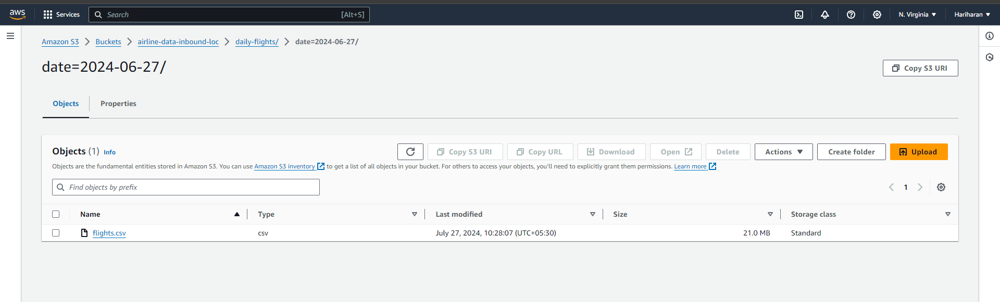{width="6.5in" height="1.9722222222222223in"}

Go to s3 source bucket and enable amazon
eventbridge.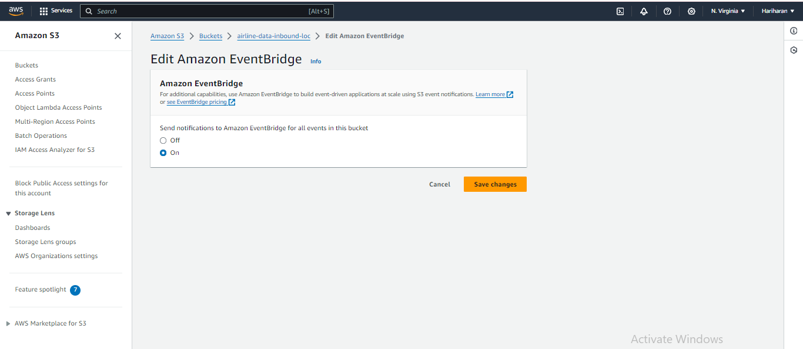{width="6.5in"
height="2.8333333333333335in"}

**Step 2. Create Redshift tables and load the dimensional data to the
dim_table.**

Choose dc2.large node type if you are using a free trial with 2 nodes.

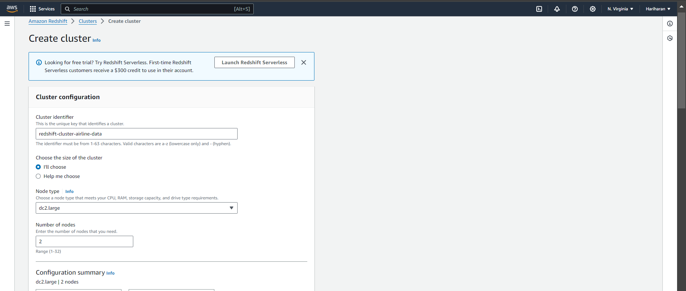{width="6.5in" height="2.763888888888889in"}

Enable loading sample data

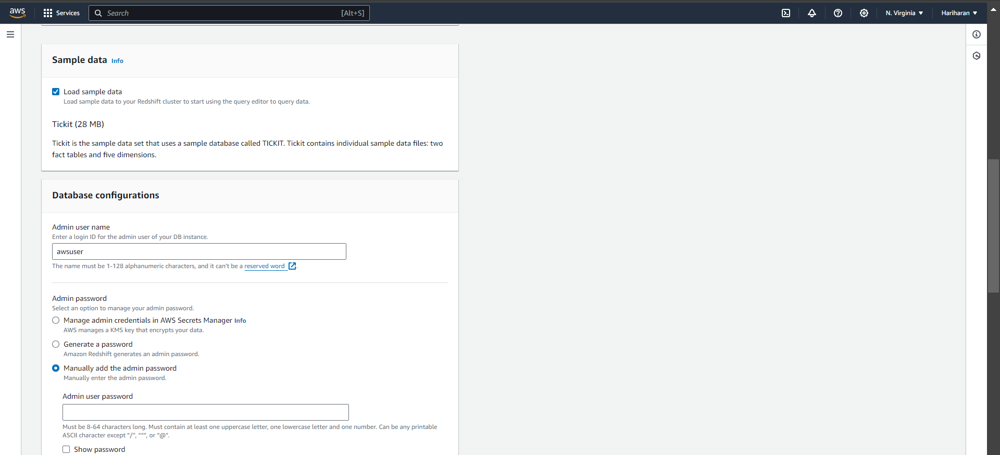{width="6.5in" height="2.9583333333333335in"}

You can choose any of the options here for managing your password. I am
choosing manual creation.

Attach the IAM role that is having all required permissions that are
necessary for the functionality of redshift. I have one IAM role that is
already created with all required policies.

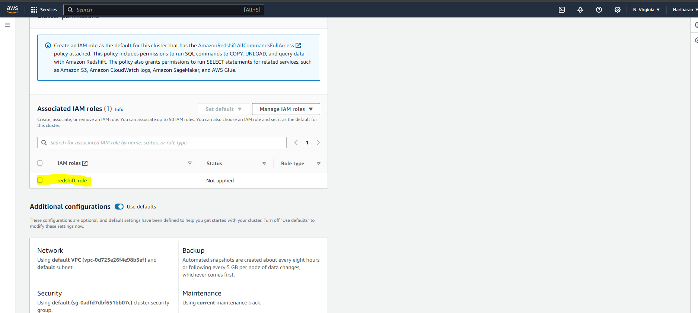{width="6.5in" height="2.9166666666666665in"}

Policies attached with IAM role for redshift.

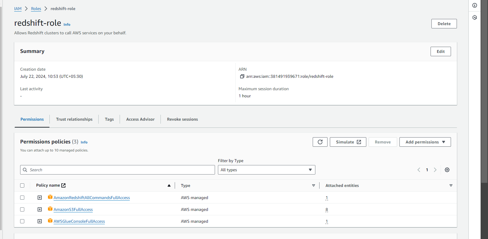{width="6.5in" height="3.1805555555555554in"}

And as you can see, I am selecting the default VPC and security group as
I don\'t want to create a dedicated VPC since I am using a free trial.

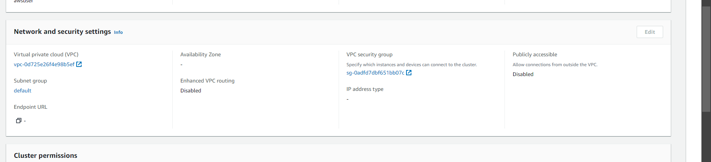{width="6.5in" height="1.4861111111111112in"}

And click on create

Redshift cluster is getting created

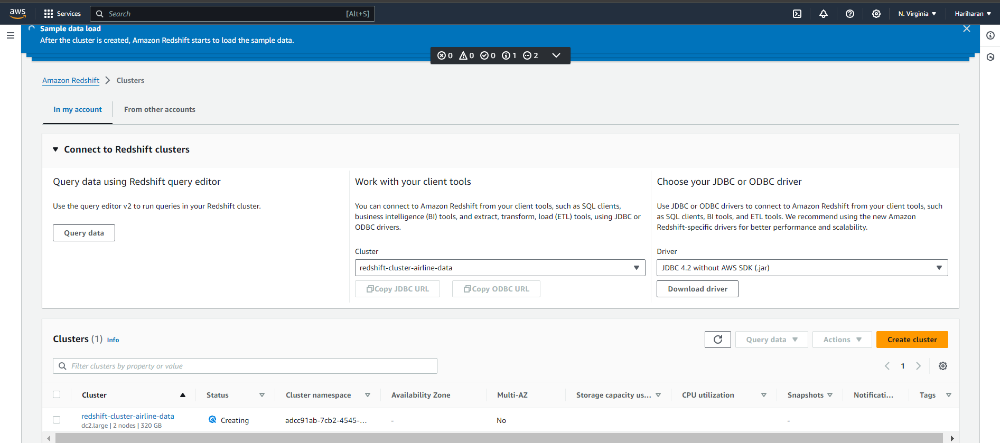{width="6.5in" height="2.875in"}

**Step 3. Creating VPC endpoints**

Before running the query, we should add the s3 gateway endpoint to the
VPC where the redshift cluster is created.

List of end points that needs to be created

Configure below mentioned vpc endpoints where our redshift is running

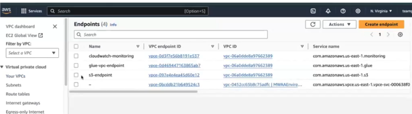{width="6.5in" height="1.8055555555555556in"}

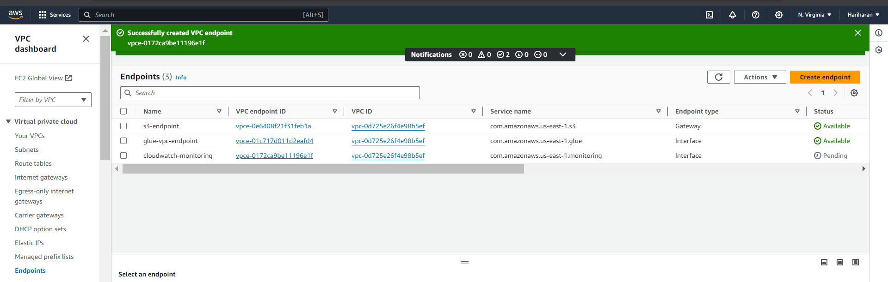{width="6.5in" height="2.0694444444444446in"}

1.  **Create s3 endpoint**

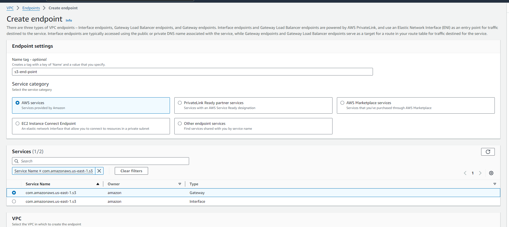{width="6.5in" height="2.9027777777777777in"}

Select VPC where you want to add the s3 gateway endpoint.(This should be
same VPC where your redshift cluster is running)

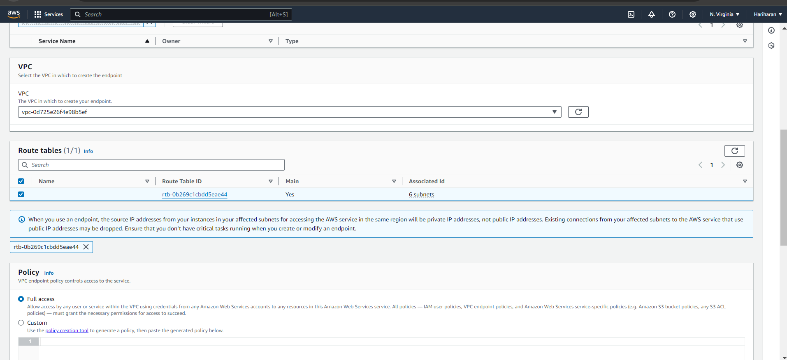{width="6.5in" height="2.986111111111111in"}

And create endpoint

In the VPC where redshift is running, apart from s3 endpoint for the
redshift, you would also need to specify two more endpoints.So that your
glue job is running even when you are orchestrating this.

Other two endpoints are.

Cloud watch monitoring endpoint

VPC access endpoint

Go to your AWS glue job, job details and check for the VPC, security
group and subnet for the **redshift connection under the connections
part** and create required endpoints for those VPC where you need to
select the security group and subnet properly.

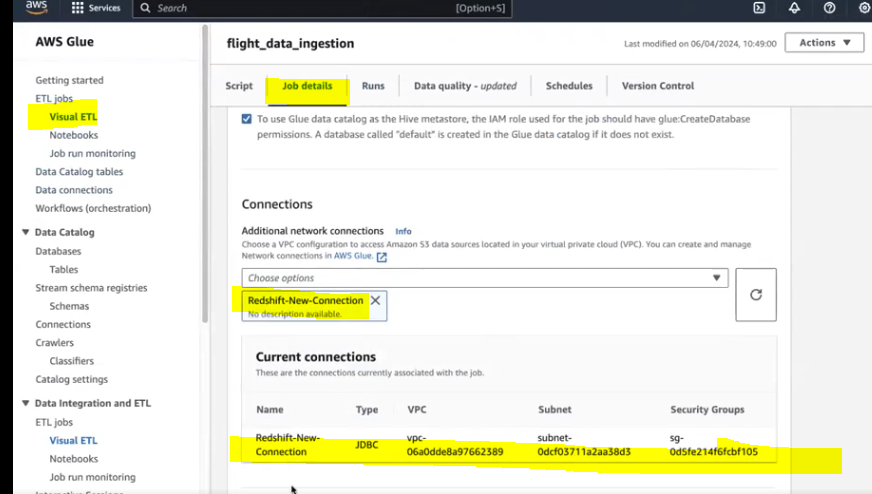{width="6.5in" height="3.6805555555555554in"}

So make sure the monitoring end point and other endpoint that we are
creating have the same subnet.

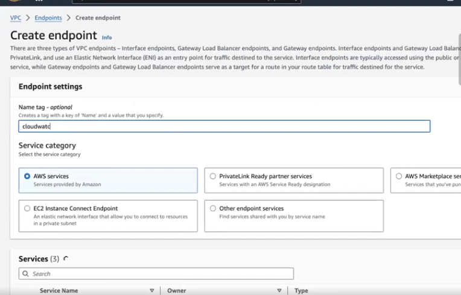{width="6.5in" height="4.166666666666667in"}

**2.Selecting the monitoring end point**

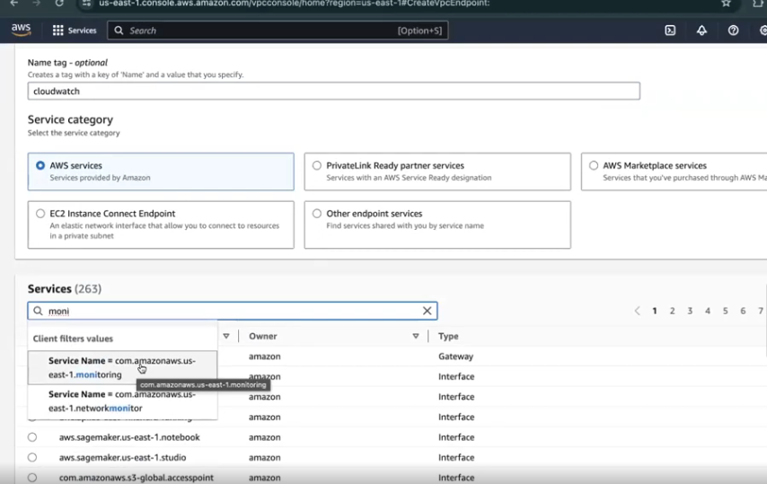{width="6.5in" height="4.097222222222222in"}

Selecting the same VPC , subnet and security group where redshift is
hosted and this you can find out from the glue job details under the
connections tab.

Select any two subnets available for high availability and fault
tolerance.

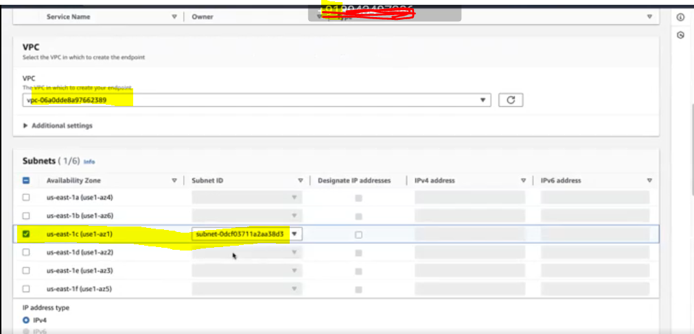{width="6.5in" height="3.138888888888889in"}

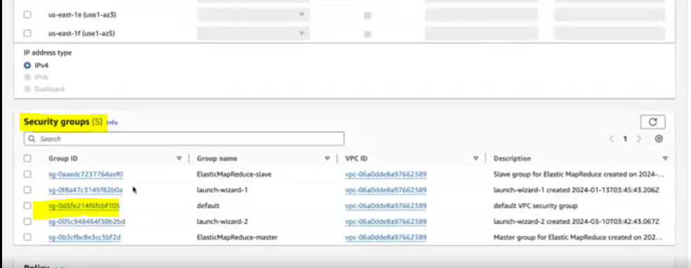{width="6.5in" height="2.5277777777777777in"}

**3.Do the same for glue end point as well**

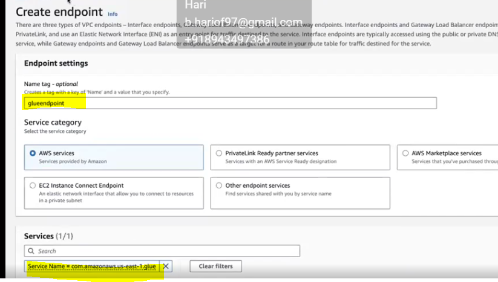{width="6.5in" height="3.6944444444444446in"}

Note: If redshift is using the default subnet, choose two subnets.
Choosing multiple subnets in AWS is often done for high availability and
fault tolerance

Also we would need to create an IAM role that will enable redshift to
read data from s3 and load the data into redshift tables.

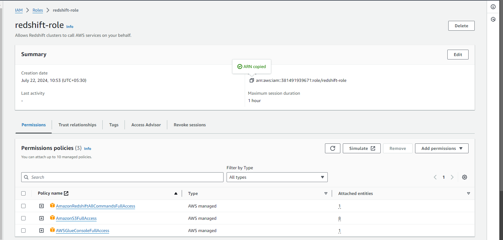{width="6.5in" height="3.111111111111111in"}

We would need to use this IAM role in redshift script to load data
directly from s3 to redshift dimensional table

**Step 4. Creating fact and dimensional table in redshift cluster.**

Once the redshift cluster is created, run the DDL queries given in the
file redshift_create_table_commands.txt. Script will do below two
processes.

> 1.This will create a fact table named daily_flights_fact and
> dimensional table.
>
> 2.Will load the data stored in s3 into a dimensional table.

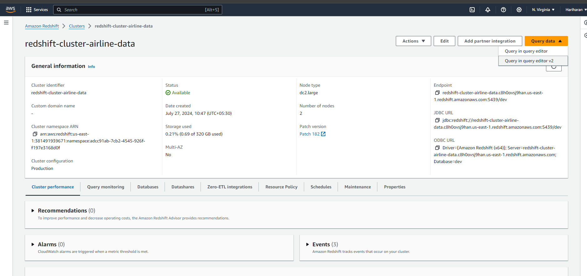{width="6.5in" height="3.0555555555555554in"}

Created and loaded redshift dimensional table successfully with IAM role
that we created

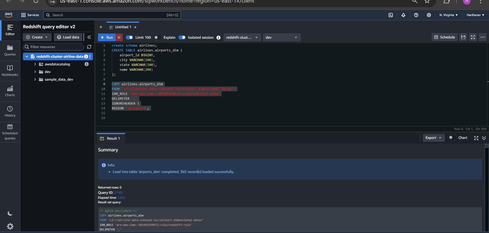{width="6.5in" height="3.0972222222222223in"}

Now create a fact table also, which will be our data landing table in
which the data analysis team will be doing their analysis.

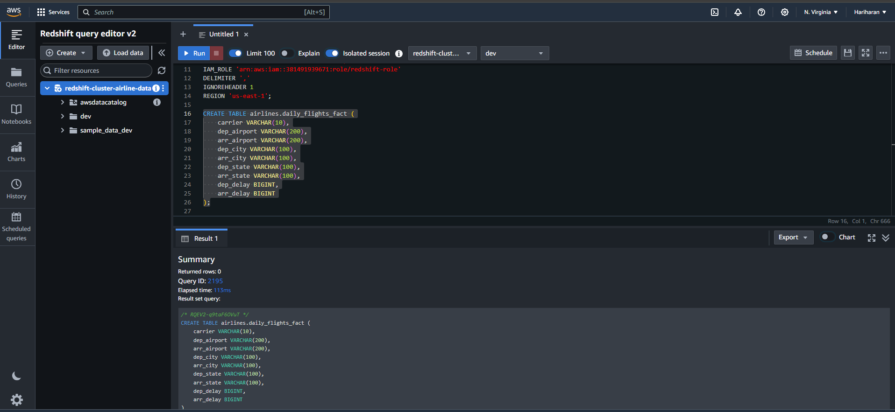{width="6.5in" height="3.0in"}

**Notes on fact table:**

The fact table that we created is a denormalized table, where we have
all details.

If we only ingest the s3 directly with some transformation into redshift
into a fact table with limited data, the data analysis team would need
to write a join to perform the analysis. So we denormalized the data
before writing to redshift by combining dim and fact and load to
redshift for ease of analysis by the data analysis team. In DWH, we
don\'t load denormalized table, they would need to perform join and this
will slow down performance

**Step 5. Now create connections, crawlers and data catalog tables**

First create a glue database

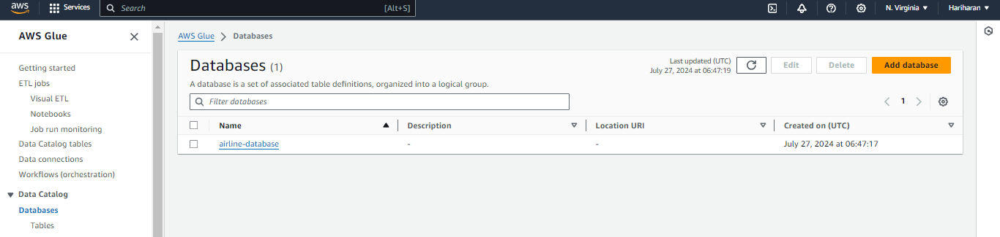{width="6.5in" height="1.5416666666666667in"}

Create JDBC connections in aws glue for redshift to be used by the
crawler.

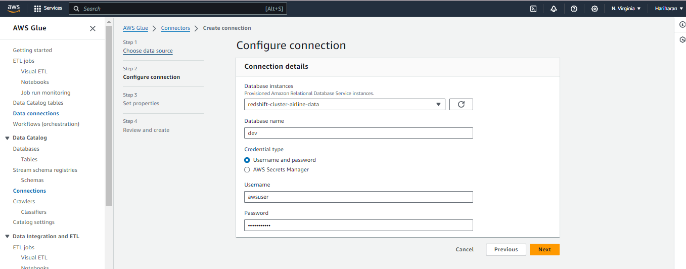{width="6.5in" height="2.5416666666666665in"}

Keep the default setting and save.

Now test the connection. For this You would need an IAM role that
enables us to connect to redshift. This same IAM role we will be using
in the rest of our project when creating a step function and glue ETL.
So add necessary permissions as below.

I have created an IAM role named glue role with following permissions.

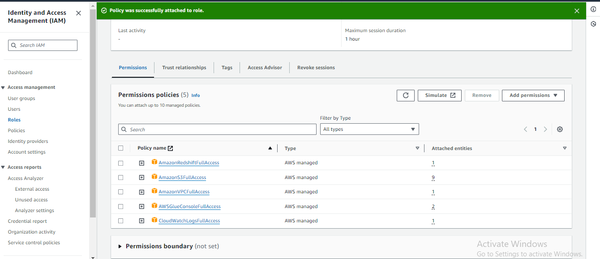{width="6.5in" height="2.8194444444444446in"}

Please make sure testing pass before proceeding forward.

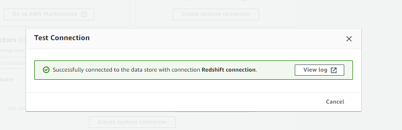{width="6.5in" height="2.111111111111111in"}

**Create Glue crawlers.**

3 crawlers and 3 metadata tables are needed.

1.  One for dimensional redshift table - airport_dimensional redshift
    table (almost Constant data) -\>
    [[[airline_dim_table_crawler]{.underline}]{.mark}](https://us-east-1.console.aws.amazon.com/glue/home?region=us-east-1#/v2/data-catalog/crawlers/view/airline_dim_table_crawler)

2.  One for s3 flights.csv raw data -\> airline-raw-data-crawler

3.  One for flight_fact redshift table.-\> airline-fact-table-crawler

1.Dimension table crawler. Specify the path as
dev/airports/airports_dim(redshift table path)

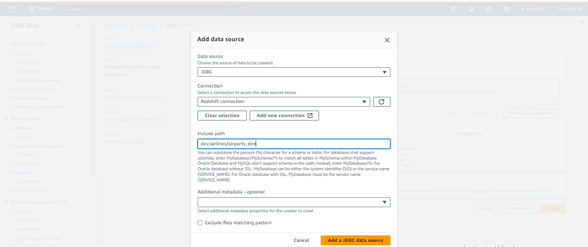{width="6.5in" height="2.736111111111111in"}

Select the glue role that we created above

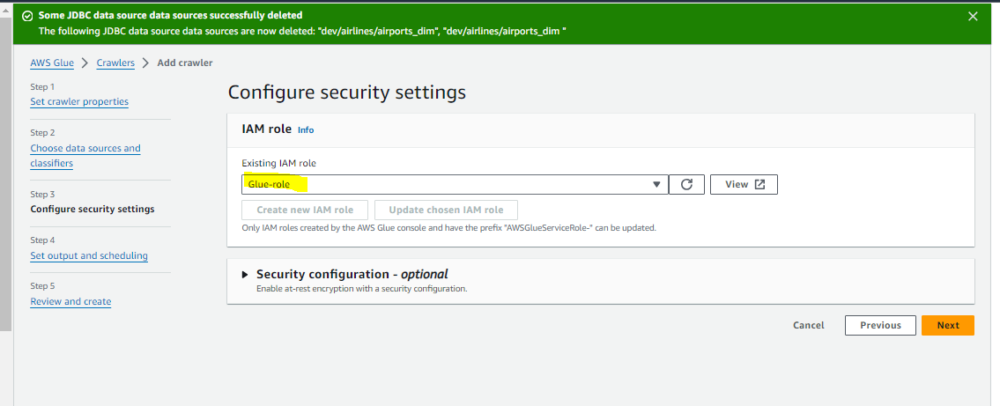{width="6.5in" height="2.638888888888889in"}

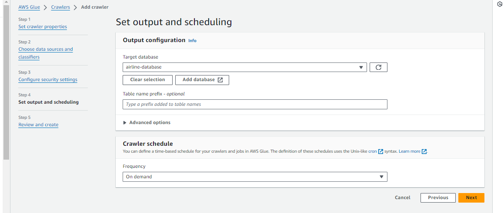{width="6.5in" height="2.75in"}

2.Fact table crawler. Path: dev/airline/.daily_flights_fact.

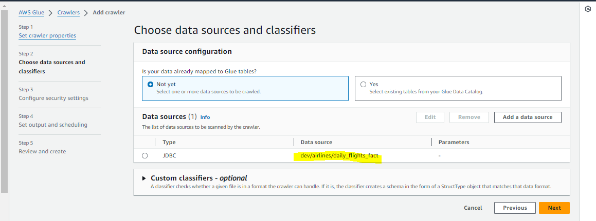{width="6.5in" height="2.4166666666666665in"}

3\. Raw data crawler to crawl data source( s3)

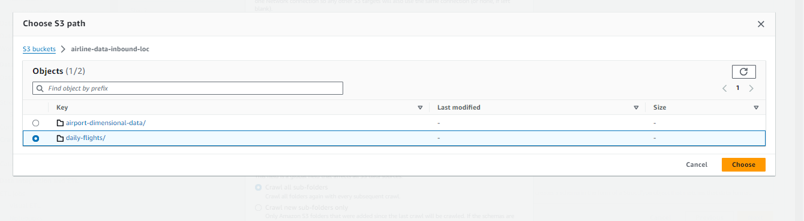{width="6.5in" height="1.8055555555555556in"}

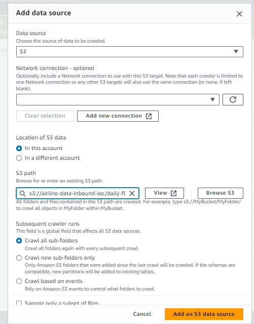{width="5.21875in" height="6.65625in"}

Here select crawl all subfolders. Instead we will enable bookmarking in
our glue ETL job to load only the unread new files thereby achieving
incremental load.

So 3 crawlers are created

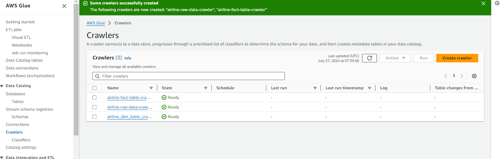{width="6.5in" height="2.0694444444444446in"}

Now run and generate catalog tables

Here we have only two catalog tables created. One for raw s3 data and
another for a dim redshift table. At these both places we have some
data.

AWS Glue Crawler does not create a table for empty Amazon Redshift
tables. This behavior is because the crawler relies on reading data to
infer the schema and create the table definition in the Glue Data
Catalog. If the table in Redshift is empty, the crawler has no data to
read and thus cannot infer the schema.

So load some sample data into the redshift fact table and re-run the
crawler for the fact table.

Now all three tables are created in Glue catalog

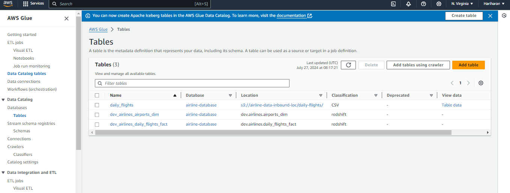{width="6.5in" height="2.4583333333333335in"}

Before moving to the next steps. Understand below details.

Source is a raw data catalog having one million records.

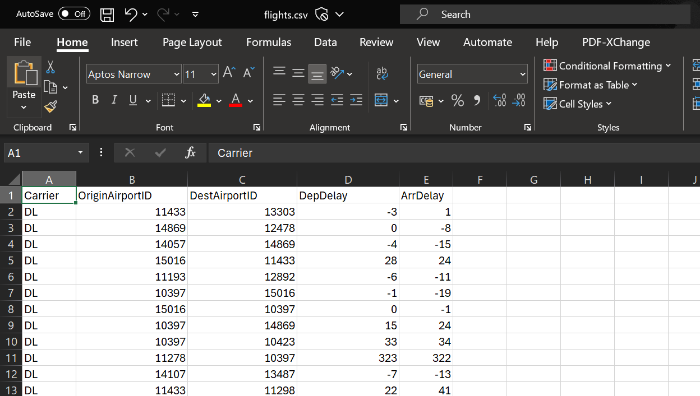{width="6.5in" height="3.1614588801399823in"}

This is how dimensional data looks
like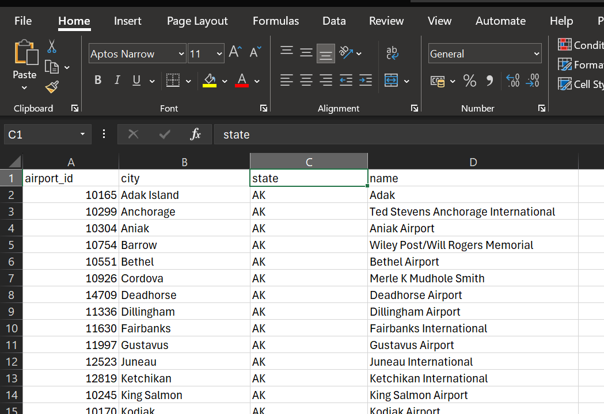{width="6.5in" height="3.16330271216098in"}

We should write the data to the final table(fact table) in the below
format.

CREATE TABLE airlines.daily_flights_fact (

carrier VARCHAR(10),

dep_airport VARCHAR(200),

arr_airport VARCHAR(200),

dep_city VARCHAR(100),

arr_city VARCHAR(100),

dep_state VARCHAR(100),

arr_state VARCHAR(100),

dep_delay BIGINT,

arr_delay BIGINT

);

We need to fetch the complete details from the dimension table based on
the OrginAirportID and DestAirportD. So we need to make join between
these two data's

We need to do two joins why?. This will be the actual SQL query to join
and look up the dim table for airport complete details for deptairport
id and destination airport id from daily csv data.

SELECT

flights.Carrier,

flights.OriginAirportID,

origin_airport.city AS OriginCity,

origin_airport.state AS OriginState,

origin_airport.name AS OriginAirportName,

flights.DestAirportID,

dest_airport.city AS DestCity,

dest_airport.state AS DestState,

dest_airport.name AS DestAirportName,

flights.DepDelay,

flights.ArrDelay

FROM

flights

LEFT JOIN

airports AS origin_airport

ON

flights.OriginAirportID = origin_airport.airport_id

LEFT JOIN

airports AS dest_airport

ON

flights.DestAirportID = dest_airport.airport_id;

**Step 6: Create Glue ETL Job**

**Task 1: s3-raw-data-catalog**

Select data source - glue catalog table. Source is raw data is having
one million records

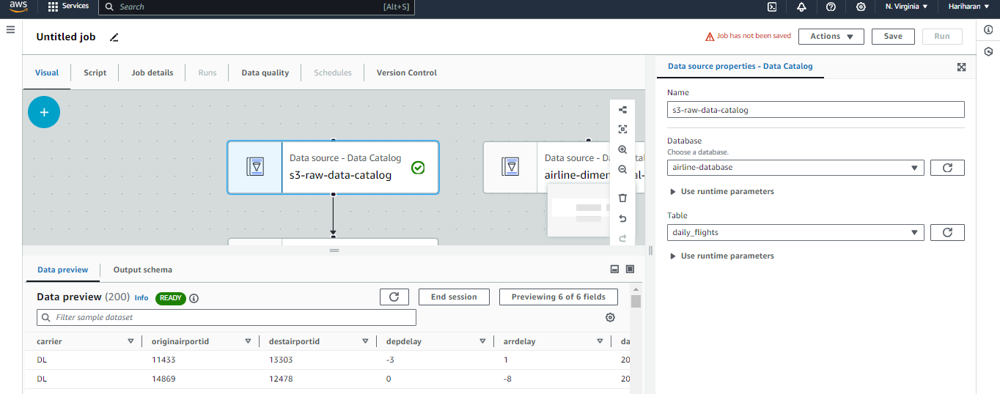{width="6.5in" height="2.5694444444444446in"}

**TASK 2: filter-long-dep-delays**

Add Filter to filter departure delay \>= 60 mins (Add a filter to only
fetch those records where flight is delayed by a certain time. There is
one column named depdelay in source.)

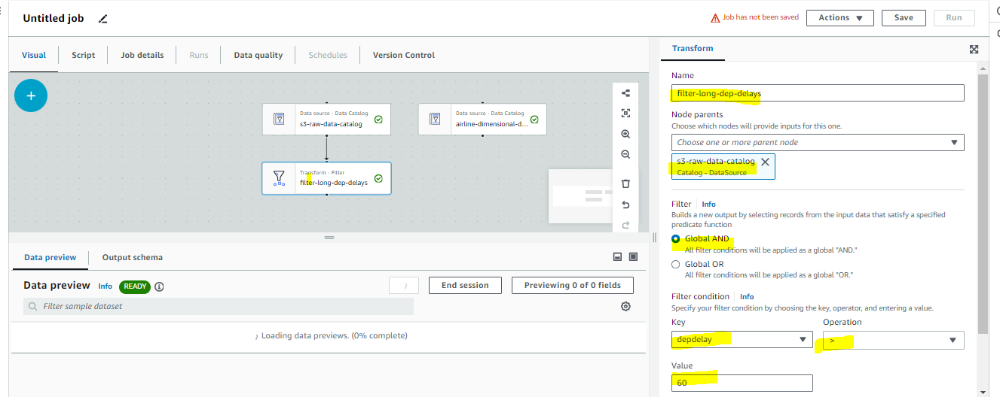{width="6.5in" height="2.5833333333333335in"}

**Task 3 - airline-redshift-dim**

Now select the dimension data catalog table which is the metadata table
for the redshift dimensional table.

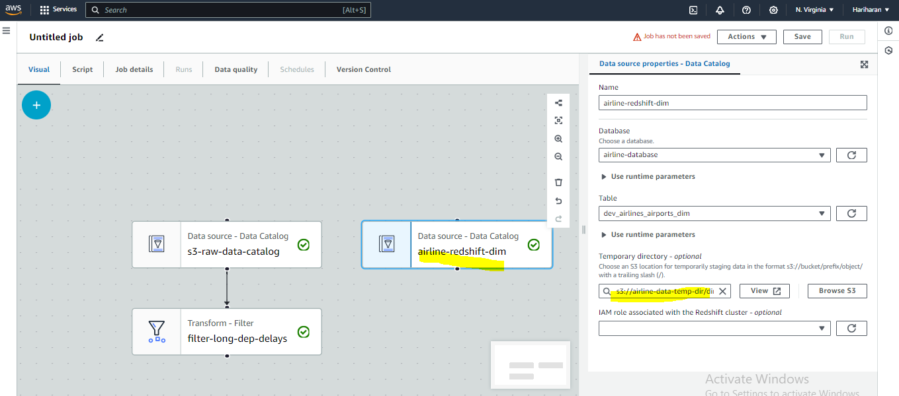{width="6.5in" height="2.875in"}

Role should the same role that is attached with the redshift

**Task 4 - join-orginid-dimRedshiftTable**

This join is to get the airport details of the origin or departure
airport based on its id from the dimension table in the redshift. So
joining keys will be Joining keys: left table - orginalportid and right
table - airport_id

Join S3 raw filtered data and dimensional data

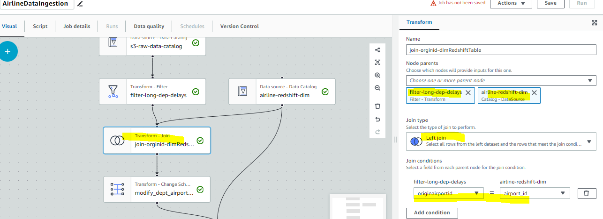{width="6.5in" height="2.375in"}

**Task 5 - modify_dept_airport_columns**

Now we would like to keep the structure or data schema as that of the
redshift fact table. So add a **change schema.**

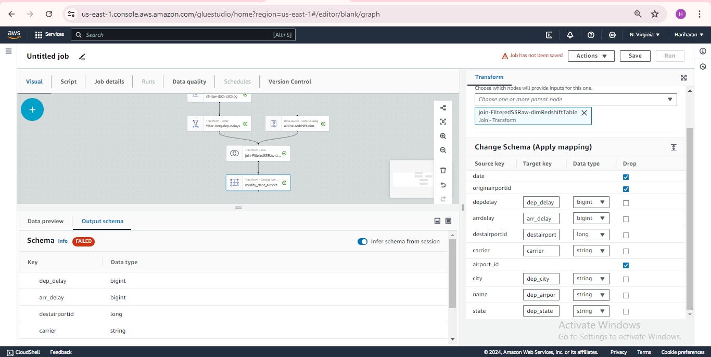{width="6.5in" height="3.2777777777777777in"}

We don\'t need date and orginairportid.Beacuse orginairportid is already
captured while joining and fetching from airportid and thereby fetching
all details related with that id (we don\'t need any id of airport at
all). Change the names of other columns to match with the final redshift
column(fact table).Change the datatype as well in accordance with the
redshift table schema.

**Task 6: join-destId-dimRedshiftTable**

Now we can perform our next joint. This is fetch the complete airport
details of destination port id of each record by making a join to the
dimension table using destination port id from left table to airport id
key in the dimension table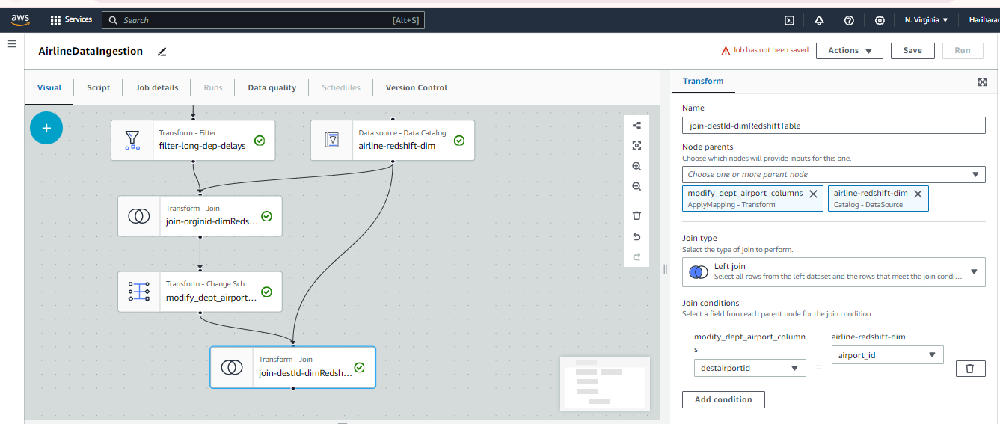{width="6.5in"
height="2.75in"}

**Task 7 - Modify-arrival-airport-columns**

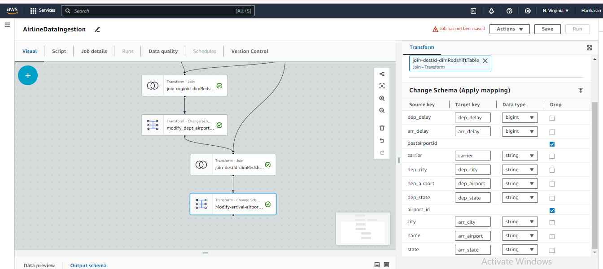{width="6.5in" height="2.9027777777777777in"}

So our final output schema should match with redshift fact schema

**Task 8: add_target_fact_table**

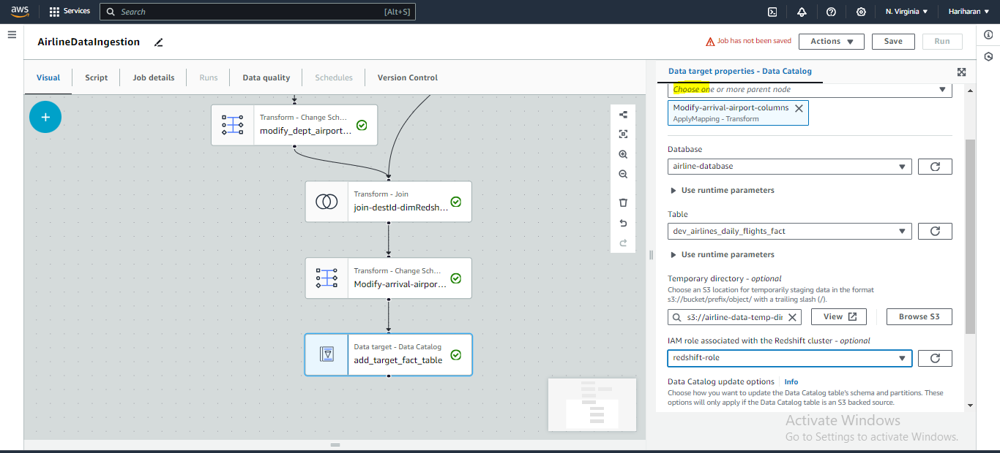{width="6.5in" height="2.9444444444444446in"}

Specify temp bucket for redshift and IAM role associated with redshift.

Now we can Configure job details

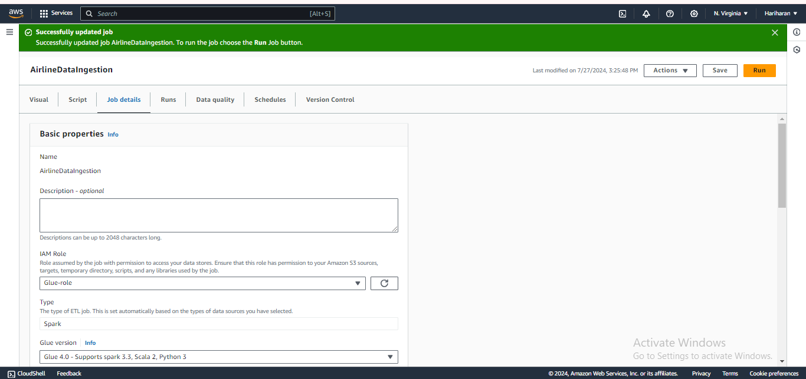{width="6.5in" height="3.0694444444444446in"}

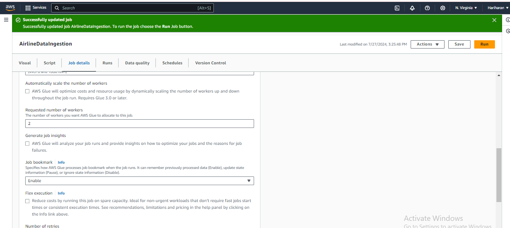{width="6.5in" height="2.9027777777777777in"}

Choose No. worker as 2 and enable job bookmaking for incremental load

Save it.

**Step 7: Creating step function**

You can copy the code and paste the step function provided into the code
part or follow below steps.

Step function:

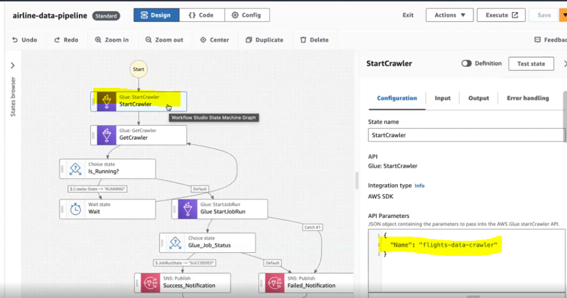{width="6.5in" height="3.4166666666666665in"}

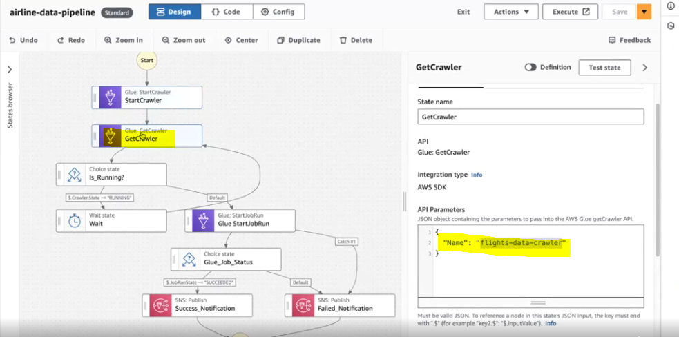{width="6.5in" height="3.2222222222222223in"}

Then select the choice state. This is similar to the if else
condition.What ever the response of get crawler , inside that one there
will be a parameter named crawler.state. Check if its running . if yes
enter into wait state continue till it finishes run and move to next
state where we are triggering the glue job(this is default)

Wait state: specify wait interval and after 5 seconds again go to get
crawler

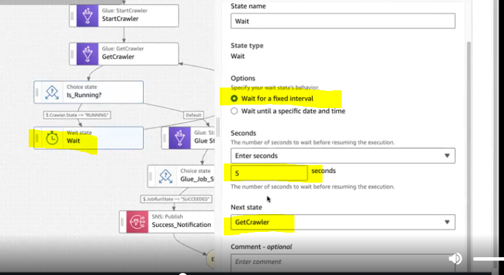{width="6.5in" height="3.5555555555555554in"}

**Next glue job start state**

Add your glue job and enable the task to
complete.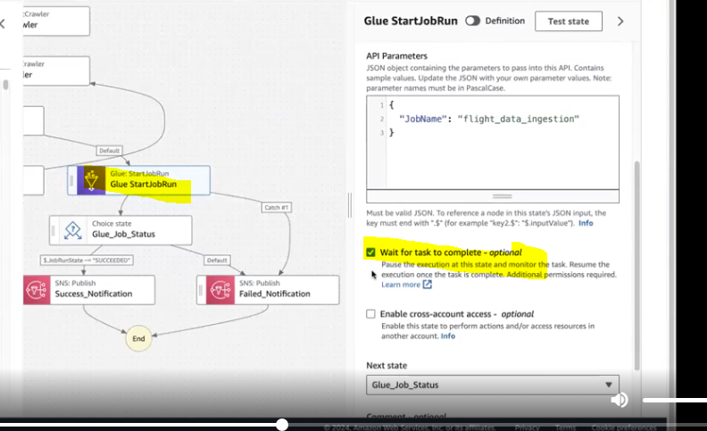{width="6.5in"
height="3.9583333333333335in"}

If the glue job is failing for some reason, we can add error handling,
go to the error handling part and add error catch, **to send sns
notification** as failed through SNS publish state.

Please Note : This is before the choice state.

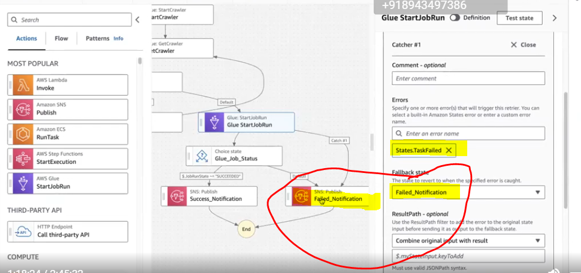{width="6.5in" height="3.0555555555555554in"}

Failure in glue jobs can happen at two places. First is when we are
starting the glue job run , that time exception is happening and
directly we will capture the exception and send the failed notification
through SNS and this is what we configured in the above step. The second
one will be after the job has been started and during some
transformation operations in the glue job, the job failed for some
reason, that needs to be captured and publish the failed notification
through SNS again.We can make use of the same publish SNS state here.
Also when the job is successful, that needs to be published to succeed
SNS state.

This can be configured through another choice state.

**Choice state:**

Wait for the glue job task to complete based on the toggle that we
enabled(Wait for task to be complete) .

**If job status is SUCCEEDED** then the next state is SNS publish for
Success.Else SNS state for failure.

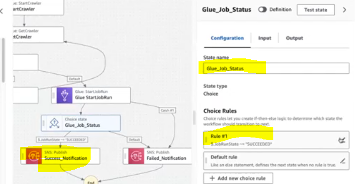{width="6.5in" height="3.375in"}

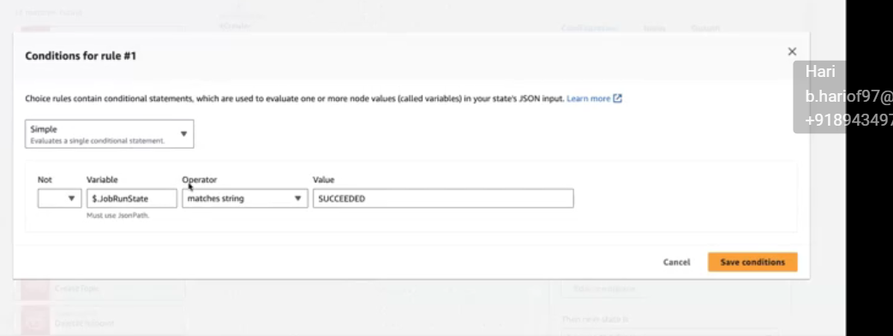{width="6.5in" height="2.4583333333333335in"}

So the jobRunState parameter will be there in response from the Glue
StartJobRun state. This will be fetched once the Glue StartJobRun
state(previous state) finishes its execution.And send to next SNS
publish for success notification with below configurations where message
is mentioned "Glue Job Execution is Successful !!"

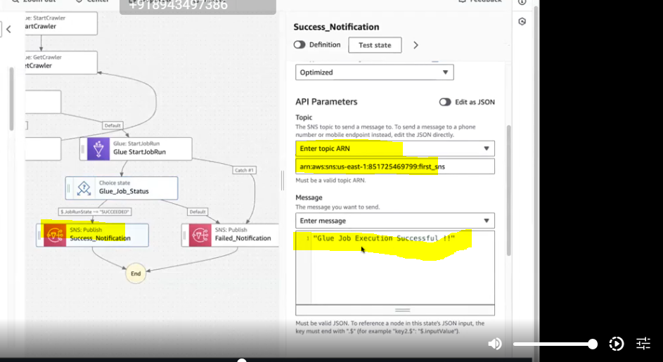{width="6.5in" height="3.5555555555555554in"}

If SUCCEED is not the case, we will send the failed notification with
the state input message itself.(It have exception string)

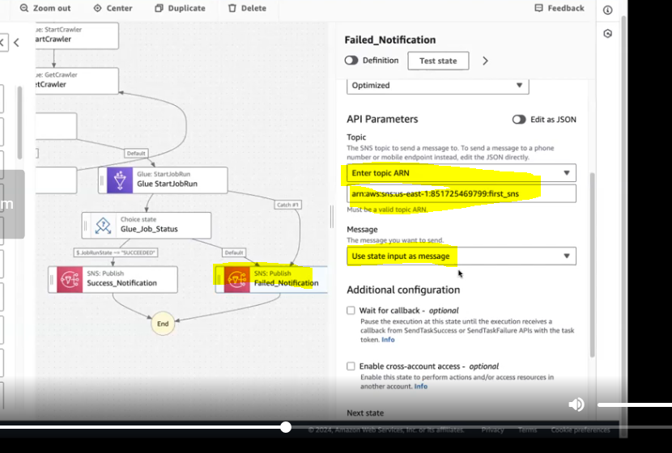{width="6.5in" height="4.388888888888889in"}

Here we are calling the same SNS service for sending both the success
and failure state with different messages for success and failure
scenarios.

Add all necessary permissions to the IAM role for step functions.

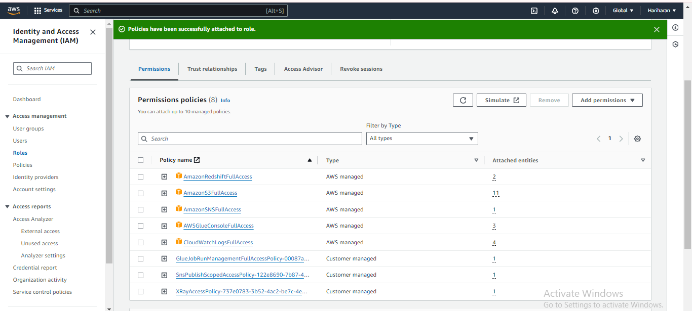{width="6.5in" height="2.9305555555555554in"}

**Step 9: Create Event bridge Rule**

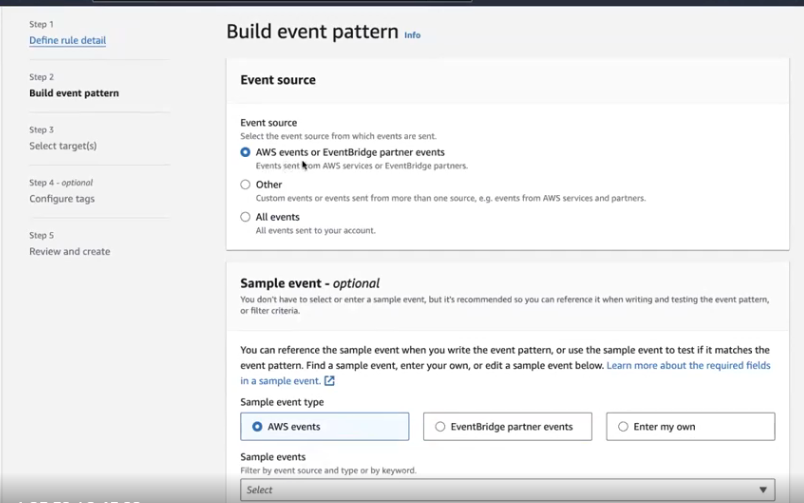{width="6.5in" height="4.069444444444445in"}

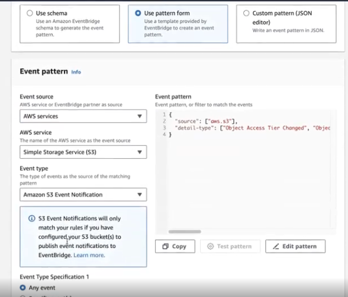{width="6.125in" height="5.21875in"}

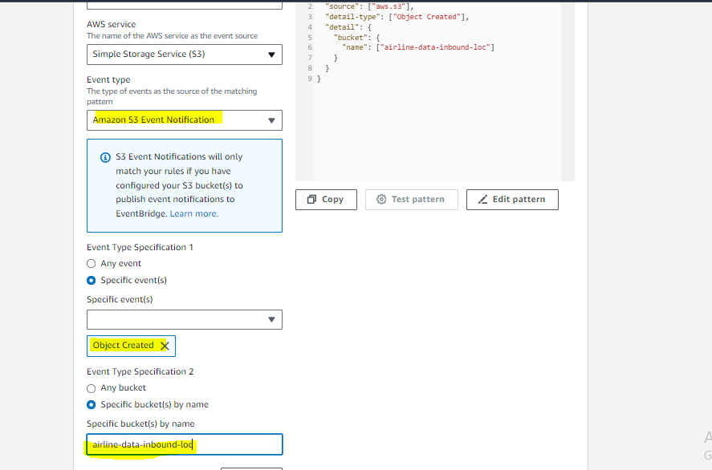{width="6.5in" height="4.291666666666667in"}

After making above mentioned configurations event pattern will be auto
generated

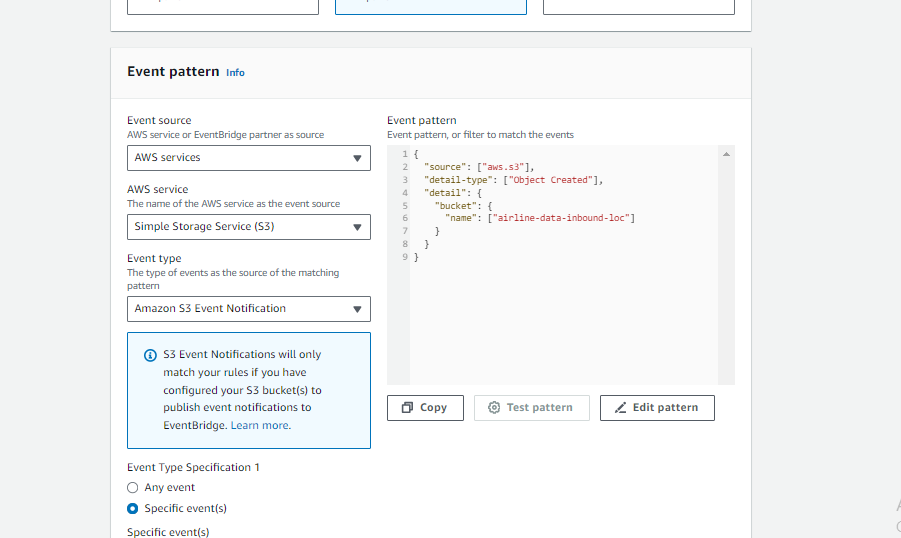{width="6.5in" height="3.875in"}

In s3, we will be adding a new folder similar to hive like partition and
that folder is also an object creation (uploading a s3 file is also an
object creation).

What if we want to check whether it is triggered only when a csv file is
uploaded. Add a suffix to the event pattern like this.

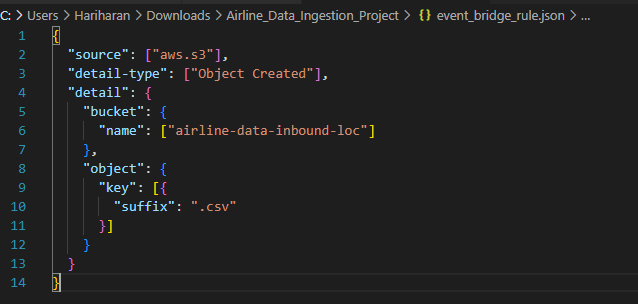{width="6.5in" height="3.0972222222222223in"}

Modified event pattern after adding csv suffix

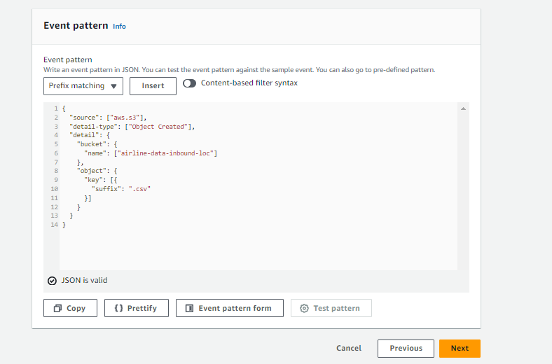{width="6.5in" height="2.6527777777777777in"}

Add target in step function

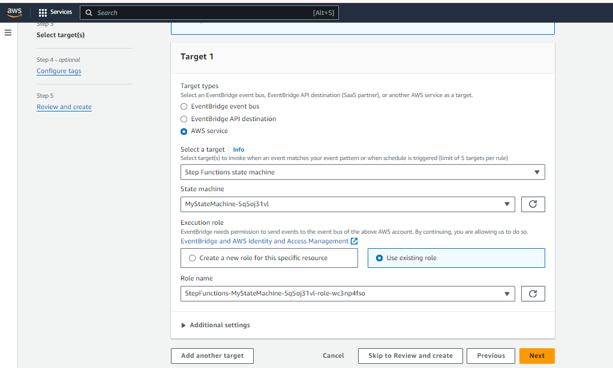{width="6.5in" height="3.9027777777777777in"}

Add all necessary permissions to the role that you are using for the
step function.

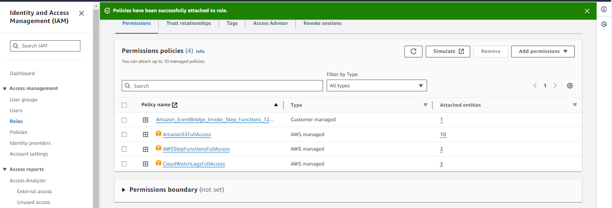{width="6.5in" height="2.2222222222222223in"}

Now we can start the testing.

Clear data from redshift fact table and delete source s3 file.

Then upload the source file to the inbound location. This should trigger
the Event bridge rule through event notification and the event bridge
will trigger the step function. Step function will trigger the glue job
and ingest data into the redshift target table.

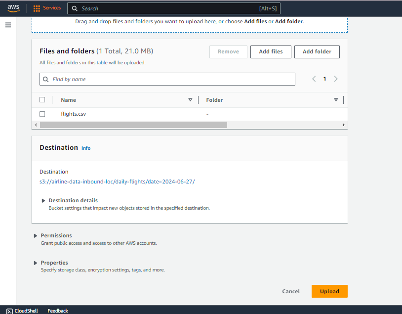{width="6.5in" height="5.069444444444445in"}

Before uploading the file, no data records in redshift fact table

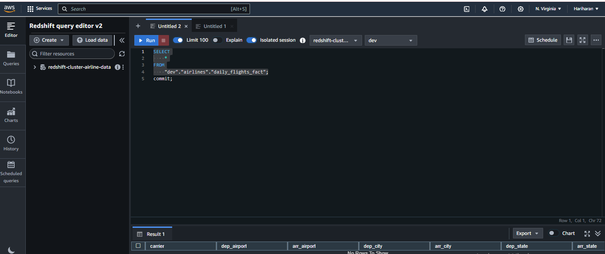{width="6.5in" height="2.736111111111111in"}

Job failed due to some error and we are getting the email through SNS
with error

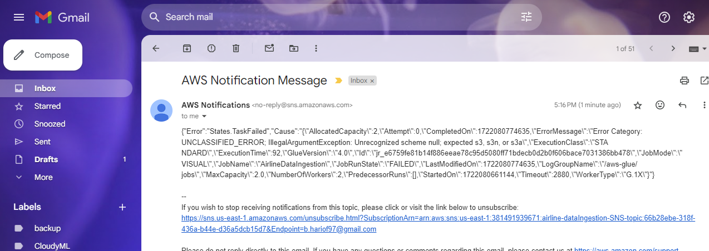{width="6.5in" height="2.3055555555555554in"}

After the successful run, records are loaded in the redshift fact table.

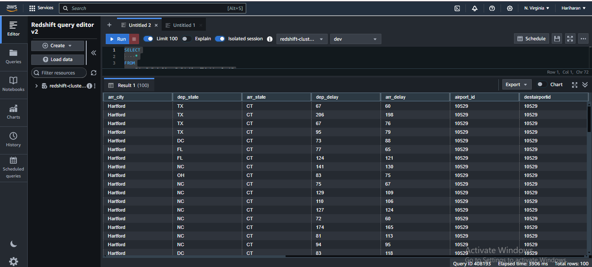{width="6.5in" height="2.9305555555555554in"}

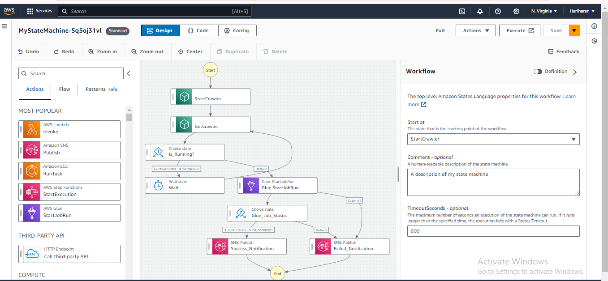{width="6.5in" height="3.013888888888889in"}

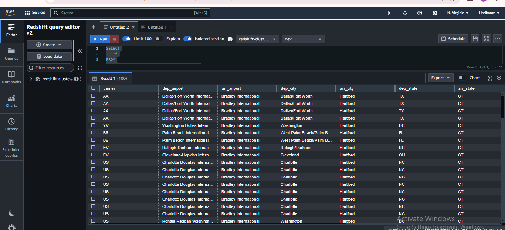{width="6.5in" height="2.9722222222222223in"}
